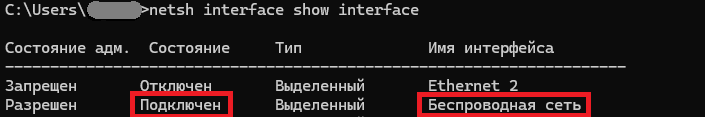
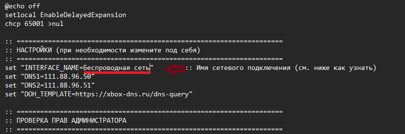

# Xbox-DNS-Switch
Скрипт (.bat) для смены DNS с DHCP на Xbox-DNS без ручной настройки (быстро сменить чтобы без запар)

В скрипте по умолчанию стоит адаптер Ethernet. Если у вас Wi-Fi или другое имя, скрипт не сработает.

Откройте командную строку (можно без прав администратора).

Введите команду:

`netsh interface show interface`
Посмотрите столбец "Имя интерфейса" для вашего активного подключения (будет состояние "Подключен") -> например, Беспроводная сеть, Wi-Fi, Ethernet, Local Area Connection).

Впишите это имя в переменную INTERFACE_NAME в скрипте (если на русском -> то так и пишите).

